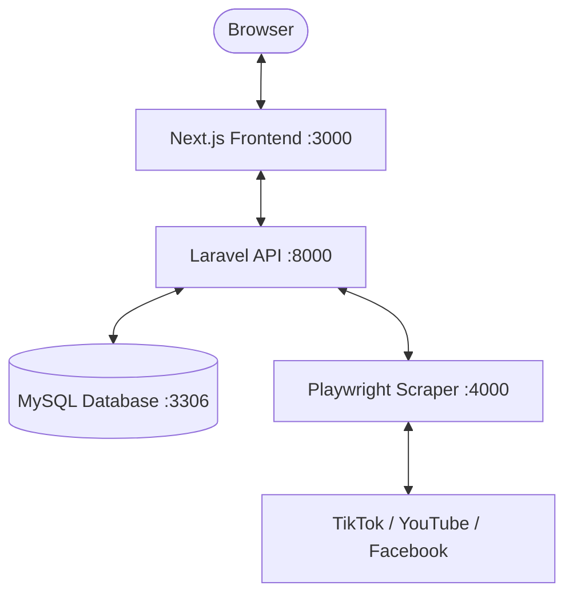

# trackeD

A lightweight analytics tool for tracking public video metrics across TikTok, YouTube, and Facebook without logins or API keys.

Developed by [dibiaskyy](https://github.com/dibiaskyy).

---

## Overview

trackeD tracks public video posts over time. It uses a headless scraper to pull metrics directly from public URLs, stores snapshots in a database, and displays engagement trends in a clean dashboard.

---

## Features

### Public URL Tracking
- **TikTok**: Standard video links and shortlinks (`vt.tiktok.com`, `tiktok.com/@user/video/...`).
- **YouTube**: Videos, Shorts, and shortlinks (`youtu.be`, `watch?v=`, `shorts/`).
- **Facebook**: Public Reels and video posts (`facebook.com/share/r/...`, `facebook.com/reel/...`).

### Unrounded Metric Parsing
- Reads internal page JSON state (`video_view_count`, `userInteractionCount`, `playCount`, `reaction_count`) to capture exact numbers instead of rounded abbreviations.
- Tracks views, likes/reactions, comments, shares, video captions, publish dates, and thumbnails.

### Per-Video Scheduling
- Set tracking duration presets (1d, 3d, 7d, 14d, 30d, or custom date).
- Live countdown badge per video.
- Automatically untracks and removes expired videos.

### Metric Distribution Charts
- Independent scaling for views, likes, comments, and shares so smaller metrics remain visible.
- Filter by individual metric or view all four together.
- Leaderboard table sorted by performance.

### Engagement Rate (ERR)
Calculated using the public engagement rate formula:

$$\text{ERR} = \frac{\text{Likes} + \text{Comments} + \text{Shares}}{\text{Views}} \times 100$$

*(YouTube calculation omits shares since YouTube does not show public share counts).*

### PDF Export
- Generates formatted A4 PDF reports directly in the browser with summary cards, platform tables, and video rankings.

### Theme
- Obsidian dark mode and high-contrast light mode with platform color accents.

---

## Architecture



- **Frontend**: Next.js, React, Recharts, jsPDF, CSS Modules
- **Backend**: Laravel 11, Eloquent, MySQL 8
- **Scraper**: Node.js, Express, Playwright
- **Runtime**: Docker Compose

---

## Setup

### Prerequisites
- Docker & Docker Compose
- Git

### 1. Clone
```bash
git clone https://github.com/dibiaskyy/trackeD.git
cd trackeD
```

### 2. Start Containers
```bash
docker compose up -d --build
```

### 3. Run Migrations
```bash
docker compose exec backend php artisan migrate --force
```

### 4. Ports
- Web App: http://localhost:3000
- REST API: http://localhost:8000/api
- phpMyAdmin: http://localhost:8080

---

## API

| Method | Route | Description |
| :--- | :--- | :--- |
| `GET` | `/api/posts` | List tracked posts with latest metrics |
| `POST` | `/api/posts` | Track and scrape a new URL |
| `GET` | `/api/posts/{id}` | Get post history and snapshots |
| `POST` | `/api/posts/{id}/refresh` | Fetch fresh metrics |
| `PATCH` | `/api/posts/{id}/expiry` | Update or remove expiration date |
| `DELETE` | `/api/posts/{id}` | Untrack and delete post |

---

## Author

- [dibiaskyy](https://github.com/dibiaskyy)
- trackeD v1.0 (2026)

---

## License

MIT
